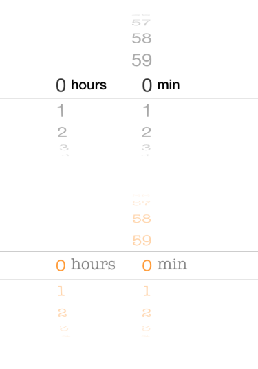

# TimeIntervalPicker
*UIDatePicker in CountDownTimer mode, implemented from scratch in Swift.*

UIDatePicker is great, but doesn't fit everybody's needs. It's look is not customizable, functionality is limited to picking a count down time - have you noticed, that you can't select 0 hours, 0 minutes? That's because you're not supposed to count down from zero!

TimeIntervalPicker reimplementes UIDatePicker in CountDownTimer mode from scratch. By default it looks and feels exactly the same as the original, except you can easily change that by setting custom fonts. At the same time, the interface remains compatible with UIDatePicker, what means that in most cases you can use TimeIntervalPicker as a drop-in replacement. Oh, and it allows you to select 0 hours, 0 minutes.

## Requirements

iOS 8.0+, Xcode 6.4

## Installation

TimeIntervalPicker is available through [CocoaPods](http://cocoapods.org). To install
it, simply add the following line to your Podfile:

    pod "TimeIntervalPicker"

## Author

Dawid Drechny, dawid.drechny@gmail.com

## License

TimeIntervalPicker is available under the MIT license. See the LICENSE file for more info.

